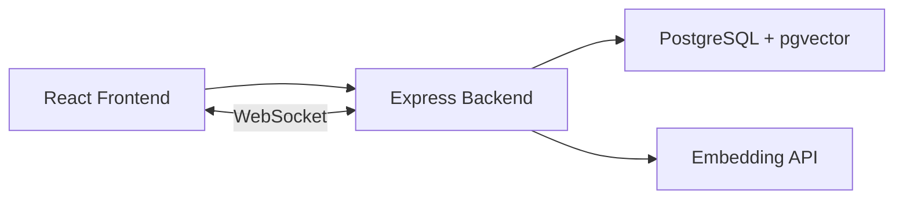

# RAG Pipeline Dashboard


   
   
   
   

A full-stack application for managing Retrieval-Augmented Generation (RAG) pipelines with real-time monitoring, document processing, and semantic search capabilities.

## Features

- **Pipeline Management**: Create, configure, and manage multiple RAG pipelines
- **Document Processing**: Upload and automatically chunk documents with configurable settings
- **Semantic Search**: Vector-based similarity search across indexed documents
- **Real-time Updates**: WebSocket-powered live updates for processing status
- **Metrics Dashboard**: Visualize pipeline performance and processing statistics
- **Activity Feed**: Track all pipeline and document events
- **Multiple Embedding Providers**: Support for OpenAI, Voyage AI (Claude/Anthropic), or mock embeddings

## Tech Stack

### Frontend
- React 18 + TypeScript
- Vite for development and builds
- TailwindCSS for styling
- React Query for server state management
- Recharts for data visualization
- Socket.io client for real-time updates
- Vitest for testing

### Backend
- Node.js + Express + TypeScript
- PostgreSQL with pgvector extension
- Socket.io for WebSocket support
- Multiple embedding providers (OpenAI, Voyage AI)
- Zod for request validation
- Vitest for testing

## Quick Start

### Prerequisites
- Node.js 20+
- Docker and Docker Compose
- API key for embeddings (OpenAI or Anthropic/Voyage)

### Development Setup

1. **Clone and install dependencies**:
   ```bash
   npm install
   cd frontend && npm install
   cd ../backend && npm install
   ```

2. **Start PostgreSQL with pgvector**:
   ```bash
   docker compose up postgres -d
   ```

3. **Configure environment**:
   ```bash
   cd backend
   cp .env.example .env
   # Edit .env with your API key (see Embedding Providers below)
   ```

4. **Run database migrations**:
   ```bash
   cd backend
   npm run db:migrate
   npm run db:seed  # Optional: add sample data
   ```

5. **Start development servers**:
   ```bash
   # Terminal 1 - Backend
   cd backend && npm run dev

   # Terminal 2 - Frontend
   cd frontend && npm run dev
   ```

6. **Open the dashboard**: http://localhost:5173

### Running Tests

```bash
# Backend tests
cd backend && npm test

# Frontend tests
cd frontend && npm test

# Run all tests once
cd backend && npm run test:run
cd frontend && npm run test:run
```

### Production Deployment

```bash
# Build and run with Docker Compose
OPENAI_API_KEY=your-key docker compose up -d

# Or with Voyage AI
VOYAGE_API_KEY=your-key docker compose up -d
```

## Embedding Providers

The application supports multiple embedding providers. Choose based on your existing API access:

### Option 1: OpenAI (Default)
```bash
OPENAI_API_KEY=sk-your-key-here
```
- **Models**: `text-embedding-3-small` (1536 dims), `text-embedding-3-large` (3072 dims)
- **Best for**: General use, well-documented, widely supported

### Option 2: Voyage AI (Recommended for Claude/Anthropic Users)
```bash
# Use your Voyage API key
VOYAGE_API_KEY=pa-your-key-here

# OR use your Anthropic API key (works with Voyage partnership)
ANTHROPIC_API_KEY=sk-ant-your-key-here
```
- **Models**: `voyage-3`, `voyage-3-lite`, `voyage-code-3`, `voyage-finance-2`, `voyage-law-2`
- **Best for**: Users with Anthropic API access, specialized domains (code, legal, finance)
- **Note**: If you have a Claude Console API key, you can use it directly!

### Option 3: Mock (Development/Testing)
```bash
EMBEDDING_PROVIDER=mock
```
- Generates deterministic embeddings without API calls
- Useful for development and testing

The provider is auto-detected from available API keys, or you can explicitly set:
```bash
EMBEDDING_PROVIDER=openai  # or voyage, mock
```

## API Endpoints

### Pipelines
- `GET /api/pipelines` - List all pipelines
- `POST /api/pipelines` - Create pipeline
- `GET /api/pipelines/:id` - Get pipeline details
- `PATCH /api/pipelines/:id` - Update pipeline
- `DELETE /api/pipelines/:id` - Delete pipeline
- `POST /api/pipelines/:id/start` - Start pipeline
- `POST /api/pipelines/:id/stop` - Stop pipeline
- `GET /api/pipelines/:id/metrics` - Get pipeline metrics

### Documents
- `GET /api/documents` - List documents
- `POST /api/documents/:pipelineId/upload` - Upload document
- `DELETE /api/documents/:id` - Delete document

### Search
- `POST /api/search` - Semantic search

### Dashboard
- `GET /api/dashboard/stats` - Dashboard statistics
- `GET /api/dashboard/activity` - Recent activity feed

## Configuration

### Pipeline Config Options
| Option | Description | Default |
|--------|-------------|---------|
| `chunkSize` | Characters per chunk | 512 |
| `chunkOverlap` | Overlap between chunks | 50 |
| `embeddingModel` | Embedding model (provider-specific) | text-embedding-3-small |
| `sourceType` | Document source (file/url/s3) | file |

### Environment Variables
| Variable | Description | Required |
|----------|-------------|----------|
| `DATABASE_URL` | PostgreSQL connection string | Yes |
| `OPENAI_API_KEY` | OpenAI API key | One of these |
| `VOYAGE_API_KEY` | Voyage AI API key | is required |
| `ANTHROPIC_API_KEY` | Anthropic API key (works with Voyage) | for embeddings |
| `EMBEDDING_PROVIDER` | Force specific provider (openai/voyage/mock) | No |
| `PORT` | Backend server port | No (3001) |
| `CORS_ORIGIN` | Allowed CORS origin | No (http://localhost:5173) |

## Architecture



## CI/CD

This project includes GitHub Actions workflows for:

- **CI** (`.github/workflows/ci.yml`): Runs on every PR and push to main
  - Linting and type checking for frontend and backend
  - Backend tests with PostgreSQL service container
  - Frontend component tests
  - Build verification

- **Docker** (`.github/workflows/docker.yml`): Builds and pushes Docker images
  - Triggers on push to main and version tags
  - Publishes to GitHub Container Registry

## License

MIT
